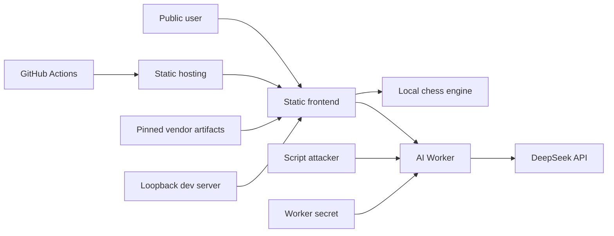

## Executive summary

ChesSight 的主要安全风险不在本地棋盘逻辑，而在公开 Cloudflare Worker 所代理的付费 DeepSeek 凭据与配额、被直接分发的 Stockfish JavaScript/WASM 供应链，以及开发时仓库根目录可能存在的秘密文件。代码层已加入严格请求字节/schema 校验、固定上游 URL、超时/取消、CSP、vendor 哈希门禁和安全本地服务器；最高剩余风险是 CORS 不能充当身份认证，必须用 Cloudflare 账户级控制补上费用防护。

## Scope and assumptions

- 范围：仓库内 HTML/CSS/JavaScript、`worker/`、本地开发脚本、CI、manifest、文档和直接分发的第三方资产。
- 假设生产前端公开部署在 GitHub Pages/`chessight.art`，Worker 通过公开 HTTPS `workers.dev` 端点提供无登录服务；证据：`README.md`、`js/commentary.js:1-3`、`worker/src/index.js:3-8`。
- 假设没有账户、数据库、会话、多租户或服务端棋局存储；棋谱/FEN 为低敏感数据，`DEEPSEEK_API_KEY` 和可计费配额为高价值资产。
- 假设 Cloudflare/DeepSeek/GitHub Pages 平台本身、Cloudflare 账户控制台配置及法律意见不在代码审计范围内。
- 已在开始修复前向用户说明上述假设并邀请更正；本轮未收到补充，因此流量规模、费用容忍度和是否关闭 `workers.dev` 仍为开放问题。
- 会显著改变风险排序的问题：日/峰值请求量是多少；是否已有 WAF/Rate Limiting/费用告警；是否允许默认开启 AI 解说；是否存在尚未披露的用户身份或敏感棋局数据。

## System model

### Primary components

- 静态前端：`index.html` 加载 `js/main.js`，本地 chess.js 处理规则，Stockfish Worker/WASM 做客户端分析；CSP 位于 `index.html:5-13`。
- AI 解说客户端：`js/commentary.js:46-74` 将受限 JSON 排队发往固定 Worker，`js/commentary.js:76-176` 解析 SSE 并实施截止时间与资源清理。
- Cloudflare Worker：`worker/src/index.js:195-283` 验证来源、方法、secret、速率和 payload，再以固定 URL/模型调用 DeepSeek。
- 开发/交付：`scripts/serve.mjs:17-72` 只服务公开 allowlist；`.github/workflows/ci.yml:10-20` 运行测试与静态/哈希检查。
- 第三方运行产物：`js/vendor/chess.js`、`js/vendor/stockfish-18-lite-single.*`，来源与差异记录于 `VENDOR.md:5-23`。

### Data flows and trust boundaries

- 用户浏览器 → 静态前端：棋盘点击、键盘、FEN 开发钩子；DOM/ES Modules，本地解析；无认证，输入受 chess.js 和摆棋完成校验约束。
- 静态托管 → 浏览器：HTML、JS、SVG、PNG、WASM；HTTPS 由托管平台提供；CSP 限制脚本/连接/Worker 来源，CI 固定 vendor 哈希。
- 浏览器 → AI Worker：SAN 棋谱、FEN 或枚举开局 ID；HTTPS JSON；浏览器 CORS 白名单但无身份认证；客户端队列限制不属于服务端安全边界。
- Internet → AI Worker：任何脚本客户端都可直连并伪造 Origin；Worker 在 `worker/src/index.js:85-175` 执行 8 KiB 字节上限、JSON/schema、SAN/FEN 和枚举校验，在 `worker/src/index.js:215-229` 做 isolate 内后备限流。
- AI Worker → DeepSeek：固定 HTTPS URL、secret Authorization、受限 prompt 与 `max_tokens`；`worker/src/index.js:231-271` 传播取消、15 秒超时并拒绝非 SSE/失败响应。
- 开发者工作区 → 本地浏览器：Node HTTP 只绑定 loopback 并仅公开前端 allowlist；`DS.env`、`.git/`、`worker/` 均不能经该服务器访问。
- GitHub Actions → 仓库：只读 checkout 后执行 Node 检查；Action 固定完整 SHA，workflow 仅有 `contents: read` 权限。

#### Diagram

## Assets and security objectives

| Asset | Why it matters | Security objective (C/I/A) |
|---|---|---|
| `DEEPSEEK_API_KEY` | 泄露可导致未授权调用和费用损失 | C, I |
| DeepSeek 配额/Worker 可用性 | 公开代理被滥用会耗尽配额，使正常解说不可用 | A, I |
| 前端代码与 CI 发布链 | 篡改可向所有访问者执行恶意脚本 | I |
| Stockfish/chess.js vendor 产物 | 在浏览器内解析输入或执行 WASM，篡改影响所有用户 | I, A |
| 棋谱/FEN | 会发送给第三方 AI；虽低敏感，用户仍需知情 | C |
| 棋局状态/训练结果 | 错误规则或异步旧结果会误导训练 | I |
| 本地秘密文件与 Git 元数据 | 通用目录服务器可能意外公开凭据和源历史 | C |
| 安全/运维日志 | 用于发现滥用；又不能包含 secret、FEN 或原始 IP | I, C, A |

## Attacker model

### Capabilities

- 远程匿名攻击者可访问公开静态站点和 Worker，可构造任意 HTTP 请求、伪造 Origin、并行请求与合法 SAN/FEN 序列。
- 供应链攻击者可能控制个人维护者账户、可移动 Git 标签或被替换的 vendor 文件；CI/提交者可修改仓库内容。
- 本地同网段攻击者可尝试访问开发机监听端口；恶意网页可诱导浏览器请求 loopback 服务，但不能绕过服务端路径 allowlist。

### Non-capabilities

- 没有证据表明匿名用户可控制 DeepSeek 上游 URL、Authorization 头、文件系统路径、子进程或 HTML sink。
- 没有服务端数据库、登录态或其他用户记录可横向读取；未假定攻击者已控制 Cloudflare/GitHub/DeepSeek 账户。
- 合法 chess 输入本身不直接获得 JavaScript 执行；模型输出只进入 `textContent`。

## Entry points and attack surfaces

| Surface | How reached | Trust boundary | Notes | Evidence (repo path / symbol) |
|---|---|---|---|---|
| 静态页面与 CSP | 公开 GET | Internet → browser | 本地脚本/样式/WASM；连接只允许固定 Worker | `index.html:5-13` |
| 棋盘/摆棋/FEN | UI、`window.app.loadFen` | User input → chess logic | chess.js 校验完成局面，摆棋中允许临时非法盘面 | `js/main.js` `activateSquare`, `buildFen`, `window.app` |
| AI Worker POST | 公开 HTTPS | Internet → privileged proxy | 无认证；CORS 只约束浏览器读取 | `worker/src/index.js:195-229` |
| JSON/SAN/FEN parser | Worker POST body | Untrusted bytes → prompt | 8 KiB、字段白名单、SAN/FEN 基本结构、开局枚举 | `worker/src/index.js:85-175` |
| DeepSeek subrequest | Worker outbound fetch | Worker secret → third party | URL固定、15秒、取消传播、SSE类型检查 | `worker/src/index.js:231-280` |
| SSE model output | Worker → browser | Third-party text → DOM | `textContent`，队列/流有超时与清理 | `js/commentary.js:76-176`, `js/main.js` `streamCommentary` |
| Stockfish Worker/WASM | 首次引擎请求 | Vendor binary → browser worker | CSP + 本地来源 + SHA-256 门禁；JS glue 来源未闭环 | `js/engine.js:32-98`, `VENDOR.md:8-9` |
| 本地开发服务器 | loopback 8173 | Workspace → browser | allowlist；拒绝 secrets、`.git`、Worker 源码 | `scripts/serve.mjs:17-72` |
| CI | push/PR | Repository changes → verification | 最小权限、Action SHA 固定、无外部测试请求 | `.github/workflows/ci.yml:7-20` |

## Top abuse paths

1. 攻击者伪造允许 Origin → 批量提交合法短棋谱 → 绕过 isolate 局部限流的全局性不足 → 消耗 DeepSeek 配额并使正常服务降级。
2. 开发者误用通用根目录服务器 → 同网段请求 `DS.env` 或 `.git/config` → 凭据/仓库信息泄露；官方 `scripts/serve.mjs` 已切断该路径，但误用仍是流程风险。
3. 个人维护者账户被接管 → 恶意 chess.js/Stockfish.js 发布物出现 → 开发者更新 vendor → 恶意解析器/WASM 进入所有用户浏览器；当前哈希门禁只阻止未经审查的漂移，不判断新版本善恶。
4. 仓库中的未知来源 Stockfish JS glue 被误认为官方产物 → 后续无法提供/审计对应源码 → 安全审计与 GPL 再分发失败，且无法可靠重建。
5. 攻击者提交边界 JSON、超大 body 或挂起上游 → Worker/浏览器队列资源耗尽；8 KiB 流式限制、总/空闲截止和队列上限已降低风险。
6. 恶意或被劫持模型返回 HTML/脚本样文本 → 前端显示输出；`textContent` 与 CSP 阻止执行，残余影响主要是误导性文本。

## Threat model table

| Threat ID | Threat source | Prerequisites | Threat action | Impact | Impacted assets | Existing controls (evidence) | Gaps | Recommended mitigations | Detection ideas | Likelihood | Impact severity | Priority |
|---|---|---|---|---|---|---|---|---|---|---|---|---|
| TM-001 | 远程匿名脚本 | Worker 公开且无用户身份 | 伪造 Origin 并跨 isolate/位置持续调用付费代理 | 配额耗尽、费用、解说不可用 | API 配额、Worker A | 受限 payload/max_tokens、后备 30/min、结构化日志（`worker/src/index.js:33-68,215-280`） | CORS 非认证；Map 不全局一致 | Cloudflare WAF/Rate Limiting；费用告警/熔断；Turnstile/短期服务端证明；评估关闭 `workers.dev` | 按状态/事件/延迟计数；429、上游调用量与费用突增告警 | high：端点和 Origin 均公开 | high：可产生费用和全局服务中断 | high |
| TM-002 | 本地网络/恶意网页 | 开发者从仓库根启动通用服务器 | 请求被忽略的 secret 或 Git 文件 | 凭据泄露 | 本地 secrets | loopback + public allowlist（`scripts/serve.mjs:17-72`）；`.gitignore:3-10` | 用户仍可绕过官方命令 | 文档/团队规范禁止根目录通用服务器；将 secret 移至 Worker 专用文件或外部 secret store | 预提交扫描；本地集成测试固定请求秘密路径并期待 404 | low：官方路径已修复 | high：一旦命中会泄密 | medium |
| TM-003 | 远程匿名脚本 | 能提交 Worker JSON | 用非法字段、指令文本或超大 body 扩张 prompt/代理用途 | 费用增加、输出操纵、资源压力 | 配额、可用性 | 字节上限、字段白名单、SAN/FEN/开局校验（`worker/src/index.js:85-175`） | FEN 未与完整棋谱做服务端语义重放 | 在 Worker 内用同版本规则引擎重放棋谱并派生 FEN；保持 token 预算 | 记录拒绝 reason，不记录 payload；非法 SAN/FEN 比率告警 | medium：输入公开 | medium：无代码执行但可滥用模型 | medium |
| TM-004 | 上游/提交者供应链攻击者 | 更新或替换 vendor/Action | 分发恶意 JS/WASM 或 CI 代码 | 客户端执行、发布链篡改 | 前端/用户、发布完整性 | vendor SHA-256 检查；Action 完整 SHA；CSP（`scripts/check.mjs`, `.github/workflows/ci.yml:15-20`, `index.html:6`） | Stockfish JS glue 精确来源/对应源码未知 | 建立可复现 Stockfish 构建；双人审查 vendor 更新；SLSA/签名或 release provenance | CI 哈希失败；Dependabot/上游 release/advisory 监控 | medium：个人维护项目且来源缺口真实 | high：进入所有浏览器 | high |
| TM-005 | 恶意模型输出/上游被劫持 | 用户启用 AI 解说 | 返回脚本样文本、误导内容或异常流 | UI 欺骗、队列阻塞 | 用户信任、可用性 | `textContent`、CSP、SSE parser、总/空闲截止（`index.html:6`, `js/commentary.js:76-176`） | 无内容安全分类；AI 默认开启 | 产品确认是否改为显式 opt-in；保留清晰数据披露和关闭入口 | 上游失败/超时/空响应指标；用户报告通道 | low：执行 sink 已封闭 | medium：主要为误导/可用性 | low |
| TM-006 | 网络故障/恶意挂流 | 上游或 WASM fetch 不结束 | 阻塞解说队列或引擎初始化 | 功能永久等待 | 前端可用性 | 解说总/空闲截止和 finally；引擎全链路 deadline、错误监听（`js/commentary.js:46-228`, `js/engine.js:20-139`） | 引擎排队任务无外部取消 API | 后续为引擎 `bestMove` 增加 AbortSignal/`stop` | 超时计数与前端可见错误 | low：代码已修复 | medium | low |
| TM-007 | 配置错误/日志读取者 | Worker observability 开启 | secret、IP、棋谱误写日志或缺 secret 仍调用上游 | 隐私/凭据泄露、错误费用 | secret、棋谱 | required secret + 运行时预检；日志函数明确不写 payload/IP（`worker/wrangler.jsonc:5-19`, `worker/src/index.js:65-68,210-213`） | 未来维护者可绕过 helper | 日志 schema 测试加入 secret/FEN 负向断言；最小日志保留期/权限 | DLP/日志查询抽样；检测 Authorization/FEN 模式 | low | high | medium |

## Criticality calibration

- **critical**：可直接、规模化泄露 Worker secret；无需用户交互即可让所有访问者执行攻击者脚本；可不可逆篡改发布账户。当前未发现。例：前端硬编码 API key、CI PR 获得写权限并执行未审查 secret。
- **high**：可重复耗尽付费配额/全局服务，或供应链产物可影响所有用户，但还需要持续滥用、提交权或上游接管。例：TM-001、TM-004；另一个例子是公开 Worker 可控制任意上游 URL（当前不存在）。
- **medium**：影响有限于开发者环境、低敏数据或需要额外前提。例：误用根服务器泄露被忽略文件（TM-002）、日志误收敏感字段（TM-007）、合法格式输入扩张 prompt（TM-003）。
- **low**：主要造成单用户功能降级或误导，且已有强缓解。例：模型文本尝试 XSS 但只进 `textContent`、单次网络挂起已被 timeout、缺失 source map 的调试 404。

## Focus paths for security review

| Path | Why it matters | Related Threat IDs |
|---|---|---|
| `worker/src/index.js` | 唯一持有付费 secret、解析公网输入并发起上游请求的特权组件 | TM-001, TM-003, TM-007 |
| `worker/wrangler.jsonc` | 运行时兼容、secret 声明与可观测性边界 | TM-001, TM-007 |
| `js/commentary.js` | 公网请求、SSE 解析、队列/取消/重试 | TM-005, TM-006 |
| `js/main.js` | 把棋局数据发送 AI，并把第三方输出落到 DOM | TM-003, TM-005 |
| `index.html` | CSP、第三方连接披露与应用入口 | TM-004, TM-005 |
| `js/engine.js` | 启动第三方 Worker/WASM 并处理超时/崩溃 | TM-004, TM-006 |
| `js/vendor/` | 直接分发并执行的第三方 JS/WASM | TM-004 |
| `VENDOR.md` | 记录哈希和 Stockfish 来源缺口 | TM-004 |
| `scripts/serve.mjs` | 防止本地仓库 secrets 被静态服务器暴露 | TM-002 |
| `.github/workflows/ci.yml` | 供应链验证与权限边界 | TM-004 |
| `scripts/check.mjs` | vendor 哈希、SVG 主动内容与引用门禁 | TM-004 |
| `.gitignore` | 阻止 secret 环境变体和本地输出误提交 | TM-002, TM-007 |

覆盖检查：已覆盖全部发现的公网/本地/CI 入口和每条信任边界；明确区分运行时、开发与 CI；未读取任何 secret 值；用户未回复的服务规模/账户控制问题均保留为假设和人工确认项。
